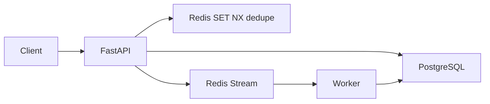

# EventLedger

[](https://github.com/ARasugit20/eventLedger/actions/workflows/ci.yml)

**Idempotent event ingestion and async processing API for order/claims-style workflows.**

> Clients send events with an `idempotency_key`. Duplicate requests return the same result — no double processing. Events move through an audit trail: `received` → `processing` → `processed` | `failed`.

**Repository:** [github.com/ARasugit20/eventLedger](https://github.com/ARasugit20/eventLedger)  
**API docs (local):** http://localhost:8000/docs  
**Live demo:** _Deploy in progress — see [Deploy](#deploy)_

---

## Table of contents

- [Problem](#problem)
- [Solution](#solution)
- [Architecture](#architecture)
- [Tech stack](#tech-stack)
- [Quick start](#quick-start)
- [API reference](#api-reference)
- [Idempotency semantics](#idempotency-semantics)
- [Event lifecycle](#event-lifecycle)
- [Project structure](#project-structure)
- [Tests & CI](#tests--ci)
- [Deploy](#deploy)
- [Roadmap](#roadmap)
- [What I learned](#what-i-learned)
- [Docs](#docs)

---

## Problem

In distributed systems, **duplicate events are normal**:

- Payment webhooks retry on timeout
- Mobile clients double-tap submit
- Load balancers replay requests
- Message brokers deliver at-least-once

Without idempotency, the same `order.created` or `claim.submitted` event gets processed twice — double charges, duplicate payouts, inconsistent ledgers.

## Solution

EventLedger guarantees **at-most-once side effects** using layered deduplication:

| Layer | Mechanism | Purpose |
|-------|-----------|---------|
| Fast path | Redis `SET idempotency:{key} NX EX 86400` | Reject obvious duplicates in ~1 ms |
| Durable | PostgreSQL `UNIQUE` on `idempotency_key` | Source of truth under races / Redis TTL expiry |
| Worker | Status guard + atomic `received → processing` claim | No double side effects on stream redelivery |
| API | Payload match on duplicate key | Same key + different body → **409 Conflict** |

Duplicate POST `/events` with the **same body** returns **200** with the original event `id`. New keys return **201**.

## Architecture



**Ingest path:** validate → Redis claim → INSERT event (`received`) → XADD stream → respond  
**Worker path:** XREADGROUP → atomic claim (`processing`) → simulate handler → `processed` | `failed`

## Tech stack

| Layer | Choice | Why |
|-------|--------|-----|
| Language | Python 3.11 | Modern typing, wide enterprise adoption |
| API | FastAPI + Pydantic v2 | Typed contracts, auto OpenAPI |
| Database | PostgreSQL 16 + JSONB | ACID, unique constraints, flexible payloads |
| Cache / queue | Redis 7 | SET NX dedupe + Streams consumer groups |
| ORM | SQLAlchemy 2.0 + Alembic | Migrations, production data layer |
| Testing | pytest + httpx + testcontainers | Real Postgres/Redis in CI |
| Lint | ruff | Fast, zero-config style checks |
| Runtime | Docker Compose | One-command local stack |

## Quick start

### Prerequisites

- Docker Desktop (or Docker Engine + Compose v2)
- Python 3.11+ (for local tests without Compose)

### Run the full stack

```bash
git clone https://github.com/ARasugit20/eventLedger.git
cd eventLedger
docker compose up --build
```

| Service | URL |
|---------|-----|
| API | http://localhost:8000 |
| OpenAPI | http://localhost:8000/docs |
| PostgreSQL | `localhost:5432` |
| Redis | `localhost:6379` |

### Sample curl flow

```bash
# 1. Health check
curl -s http://localhost:8000/health | jq

# 2. Ingest event (201 Created)
curl -s -X POST http://localhost:8000/events \
  -H "Content-Type: application/json" \
  -d '{
    "idempotency_key": "order-8821-create",
    "event_type": "order.created",
    "payload": {"sku": "X1", "quantity": 2, "customer_id": "c-99"}
  }' | jq

# 3. Duplicate ingest (200 OK — same event id)
curl -s -X POST http://localhost:8000/events \
  -H "Content-Type: application/json" \
  -d '{
    "idempotency_key": "order-8821-create",
    "event_type": "order.created",
    "payload": {"sku": "X1", "quantity": 2, "customer_id": "c-99"}
  }' | jq

# 4. Poll until worker marks processed
curl -s http://localhost:8000/events/<EVENT_ID> | jq

# 5. List processed events
curl -s "http://localhost:8000/events?status=processed&limit=10" | jq
```

## API reference

| Method | Path | Status | Description |
|--------|------|--------|-------------|
| GET | `/health` | 200 | Liveness; checks PostgreSQL + Redis |
| POST | `/events` | 201 | New event ingested |
| POST | `/events` | 200 | Duplicate idempotency key (same body) |
| POST | `/events` | 409 | Same key, different payload |
| POST | `/events` | 422 | Validation error |
| GET | `/events/{id}` | 200 / 404 | Single event by UUID |
| GET | `/events` | 200 | List with `?status=` `limit` `offset` |

### POST `/events` body

```json
{
  "idempotency_key": "order-8821-create",
  "event_type": "order.created",
  "payload": { "sku": "X1", "quantity": 2, "customer_id": "c-99" }
}
```

### Event response fields

| Field | Type | Notes |
|-------|------|-------|
| `id` | UUID | Client-facing event id |
| `idempotency_key` | string | Dedupe key |
| `event_type` | string | e.g. `order.created`, `claim.submitted` |
| `payload` | object | Opaque JSON body |
| `status` | enum | `received`, `processing`, `processed`, `failed` |
| `result` | object? | Worker output when processed |
| `error_message` | string? | Set when failed |
| `created_at` | datetime | Ingest time |
| `processed_at` | datetime? | Terminal state time |

## Idempotency semantics

1. **New key** → Redis NX succeeds → INSERT → enqueue → **201**
2. **Duplicate key, same body** → return existing row → **200**
3. **Duplicate key, different body** → **409 Conflict** (key reuse abuse)
4. **Concurrent duplicates** → DB unique constraint + Redis; all callers get same `id`
5. **Redis TTL expired, DB row exists** → INSERT fails → fetch existing → **200**

**Trade-off:** Redis is an optimization layer. PostgreSQL is always authoritative.

## Event lifecycle

```
received → processing → processed
                      ↘ failed
```

- **received:** persisted and enqueued to Redis Stream
- **processing:** worker atomically claimed the event
- **processed:** worker wrote `result` JSON
- **failed:** worker caught an error; `error_message` retained for audit

Simulate failure: use an `event_type` ending in `.fail` (e.g. `claim.fail`).

## Project structure

```
eventLedger/
├── app/
│   ├── main.py              # FastAPI routes, middleware, exception handlers
│   ├── config.py            # pydantic-settings
│   ├── db.py                # SQLAlchemy engine + session
│   ├── models.py            # Event ORM model
│   ├── schemas.py           # Pydantic request/response models
│   ├── exceptions.py        # IdempotencyConflictError
│   ├── worker.py            # Redis Streams consumer
│   └── services/
│       ├── events.py        # Ingest, list, worker helpers
│       └── idempotency.py   # Redis SET NX
├── alembic/                 # Database migrations
├── tests/                   # pytest suite (14 tests)
├── docs/
│   ├── INTERVIEW.md         # System design talking points
│   └── LOAD_TEST.md         # Load test commands + bottlenecks
├── docker-compose.yml
├── Dockerfile
└── .github/workflows/ci.yml
```

## Tests & CI

### Run tests locally

**Option A — testcontainers (matches CI):**

```bash
pip install -r requirements.txt
pytest -v
```

**Option B — against running Compose stack:**

```bash
docker compose up -d postgres redis
alembic upgrade head
USE_EXTERNAL_SERVICES=1 pytest -v
```

### Test coverage highlights

| Test file | What it proves |
|-----------|----------------|
| `test_idempotency.py` | Duplicate → 200 same id; concurrent races; 409 on payload conflict |
| `test_integration.py` | Stream enqueue; worker pipeline; failed events; double-process guard |
| `test_health.py` | DB + Redis connectivity |
| `test_events_service.py` | Stable SHA-256 payload fingerprint |

### Lint

```bash
ruff check app tests
```

GitHub Actions runs **ruff + pytest** on every push to `main`.

## Deploy

**Render / Railway (recommended):**

1. Add PostgreSQL 16 and Redis 7
2. **API service:** `alembic upgrade head && uvicorn app.main:app --host 0.0.0.0 --port $PORT`
3. **Worker service:** `alembic upgrade head && python -m app.worker`
4. Set `DATABASE_URL`, `REDIS_URL` from `.env.example`

## Roadmap

- [x] Phase 1 — Core API, Alembic, structured logging, global error handler
- [x] Phase 2 — Redis dedupe, Redis Streams worker, status lifecycle
- [x] Phase 3 — Tests, CI, interview + load-test docs
- [x] Hardening — 409 payload conflict, concurrent idempotency tests, enqueue retry
- [ ] Auth / API keys
- [ ] Dead-letter queue stream + replay
- [ ] Prometheus metrics + Grafana
- [ ] Live cloud deploy URL

## What I learned

- **Idempotency is a contract, not a library** — client keys, DB constraints, and worker guards must work together; any single layer races under retries.
- **Redis NX before DB is a latency win with a TTL caveat** — PostgreSQL must remain the authoritative dedupe store.
- **At-least-once delivery is acceptable** when side effects are guarded by atomic status claims and terminal-state checks in workers.

## Docs

- [Interview talking points](docs/INTERVIEW.md) — idempotency, at-least-once, DLQ, 10× failure modes
- [Load testing notes](docs/LOAD_TEST.md) — `hey` / `wrk` commands and first bottlenecks

---

**Resume bullet:** Built EventLedger, an idempotent event ingestion API (FastAPI, PostgreSQL, Redis) with async workers, duplicate-request safety, and CI-verified tests; documented failure modes under 10× load.
