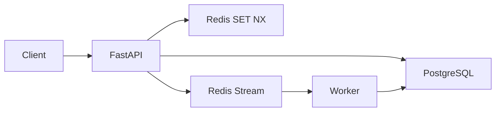

# EventLedger

[](https://github.com/ARasugit20/eventLedger/actions/workflows/ci.yml)

**Idempotent event ingestion for order and claims workflows — duplicate-safe by design.**

Clients send events with an `idempotency_key`. Retries return the same result. No double processing. Full audit trail: `received` → `processing` → `processed` | `failed`.

**Repo:** [github.com/ARasugit20/eventLedger](https://github.com/ARasugit20/eventLedger) · **API docs:** http://localhost:8000/docs

---

## 30-second pitch

EventLedger is a production-style event ingestion API: FastAPI + PostgreSQL + Redis + async worker. It solves the classic distributed-systems problem — **at-least-once delivery causing duplicate side effects** — with layered idempotency (Redis SET NX + Postgres UNIQUE + worker status guards). Observability and SQL analytics are built in.

## 60-second quickstart

```bash
git clone https://github.com/ARasugit20/eventLedger.git
cd eventLedger
docker compose up --build
```

| Service | URL |
|---------|-----|
| API + OpenAPI | http://localhost:8000/docs |
| Metrics | http://localhost:8000/metrics |
| Prometheus | http://localhost:9090 |
| Grafana | http://localhost:3000 (admin/admin) |

## Run this now

```bash
# Ingest + duplicate retry (201 then 200)
curl -s -X POST http://localhost:8000/events \
  -H "Content-Type: application/json" \
  -d '{"idempotency_key":"demo-001","event_type":"order.created","payload":{"sku":"X1"}}' | jq

curl -s -X POST http://localhost:8000/events \
  -H "Content-Type: application/json" \
  -d '{"idempotency_key":"demo-001","event_type":"order.created","payload":{"sku":"X1"}}' | jq

# Seed analytics demo data (orders, claims, duplicates)
make seed-analytics-demo

# Business KPIs
curl -s http://localhost:8000/analytics/health | jq
curl -s http://localhost:8000/analytics/duplicate-rate | jq
```

Open Grafana → **EventLedger Overview** for ingest rate, worker latency, and pending queue.

---

## Business questions answered

| Endpoint | Question |
|----------|----------|
| `GET /analytics/health` | How healthy is the pipeline right now? |
| `GET /analytics/duplicate-rate` | Which event types see the most retries? |
| `GET /analytics/latency` | p50/p95/p99 processing time by type? |
| `GET /analytics/daily-volume` | Daily ingest volume and failure rate? |

Duplicate HTTP retries log to `ingest_attempts`; `events` keeps one row per `idempotency_key`.

---

## How idempotency works

| Layer | Mechanism | Role |
|-------|-----------|------|
| Fast path | Redis `SET NX` | Reject obvious duplicates in ~1 ms |
| Durable | Postgres `UNIQUE(idempotency_key)` | Source of truth under races |
| Worker | Atomic `received → processing` claim | No double side effects on redelivery |
| API | Payload fingerprint match | Same key + different body → **409** |

Duplicate POST with same body → **200** (same event id). New key → **201**.



---

## Verify locally

```bash
pip install -r requirements.txt
make test-cov          # pytest + 75% coverage gate
ruff check app tests analytics scripts
```

CI runs the same gates on every push. See [docs/CONTRIBUTIONS.md](docs/CONTRIBUTIONS.md) for commit attribution guidance.

---

## Stack

Python 3.11 · FastAPI · PostgreSQL 16 · Redis 7 · SQLAlchemy 2 + Alembic · pytest + testcontainers · Prometheus + Grafana · Docker Compose

---

## Project layout

```
app/           FastAPI routes, worker, metrics, services
analytics/     SQL views + apply script
tests/         Idempotency, concurrency, analytics, metrics
deploy/        Prometheus + Grafana provisioning
scripts/       seed_analytics_demo.py
docs/          Interview notes, load test, contributions
```

---

## Deep dive docs

- [Interview talking points](docs/INTERVIEW.md) — idempotency, at-least-once, failure modes
- [Load testing](docs/LOAD_TEST.md) — `hey` / `wrk` commands
- [Contributions & GitHub graph](docs/CONTRIBUTIONS.md) — email, timestamps, green squares

---

**Resume bullet:** Built EventLedger — idempotent event ingestion API (FastAPI, PostgreSQL, Redis) with async workers, Prometheus observability, SQL analytics, and CI-verified concurrency tests.
