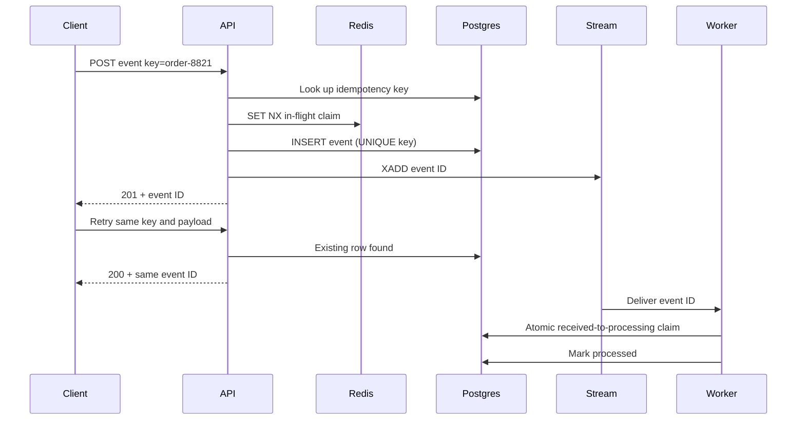

# EventLedger

[](https://github.com/ARasugit20/eventLedger/actions/workflows/ci.yml)

CI: passing (Postgres-backed integration tests via testcontainers)

**Idempotent event ingestion for retry-heavy order, claims, and webhook workflows.**

EventLedger prevents a retried request from creating a second durable event or running
the handler again. The API combines:

1. a PostgreSQL lookup for an already-committed idempotency key
   ([`app/services/events.py`](app/services/events.py));
2. Redis `SET NX` to coordinate requests that are concurrently in flight
   ([`app/services/idempotency.py`](app/services/idempotency.py));
3. `UNIQUE(idempotency_key)` in PostgreSQL as the durable race arbiter
   ([`alembic/versions/001_initial_events.py`](alembic/versions/001_initial_events.py)); and
4. an atomic worker claim (`received → processing`) so only one worker owns an event
   ([`app/services/events.py`](app/services/events.py), [`app/worker.py`](app/worker.py)).

**Live deploy:** [eventledger-production.up.railway.app](https://eventledger-production.up.railway.app) · [`/health`](https://eventledger-production.up.railway.app/health) · [`/docs`](https://eventledger-production.up.railway.app/docs)  
**Repo:** [github.com/ARasugit20/eventLedger](https://github.com/ARasugit20/eventLedger)  
**AWS companion:** [github.com/ARasugit20/eventledger-aws](https://github.com/ARasugit20/eventledger-aws) — same idempotency story on SQS + DynamoDB + Lambda

## What happens when the same event arrives twice?


```mermaid
sequenceDiagram
    participant Client
    participant API
    participant Redis
    participant Postgres
    participant Stream
    participant Worker

    Client->>API: POST event key=order-8821
    API->>Postgres: Look up idempotency key
    API->>Redis: SET NX in-flight claim
    API->>Postgres: INSERT event (UNIQUE key)
    API->>Stream: XADD event ID
    API-->>Client: 201 + event ID
    Client->>API: Retry same key and payload
    API->>Postgres: Existing row found
    API-->>Client: 200 + same event ID
    Stream->>Worker: Deliver event ID
    Worker->>Postgres: Atomic received-to-processing claim
    Worker->>Postgres: Mark processed
```

- The first request commits one row, queues one event ID, and returns **201**.
- A sequential duplicate finds that row and returns **200** with the same UUID; it is
  not queued again.
- Concurrent duplicates are narrowed by Redis, but PostgreSQL uniqueness is the final
  authority if requests still race.
- Reusing the same key with a different event type or payload returns **409**.

The guarantee is **at-least-once stream delivery with guarded handler execution**, not
exactly-once delivery across arbitrary external systems.

## One-command proof

From the repository root:

```bash
./scripts/demo_idempotency.sh
```

The script ([`scripts/demo_idempotency.sh`](scripts/demo_idempotency.sh)) starts Docker
Compose, waits for health, sends the same event twice, proves `201 → 200` with one UUID,
waits for `processed`, prints duplicate analytics and Prometheus ingest counters, and
shows the correlated API/worker logs.

## Failure modes

| Failure | Current behavior | Boundary / missing protection | Evidence |
|---------|------------------|-------------------------------|----------|
| Redis is unavailable | A retry for an already-committed key can resolve from PostgreSQL. A new event currently fails during the Redis claim. | Ingest does **not** fail open to PostgreSQL today. | [`app/services/idempotency.py`](app/services/idempotency.py) |
| PostgreSQL commits but Redis `XADD` keeps failing | The API logs after three enqueue attempts; the event remains `received`. | There is no transactional outbox or automatic scanner to enqueue the stranded row. | [`app/services/events.py`](app/services/events.py) (`_enqueue_event`) |
| Worker dies before claiming | The message remains in the Redis pending-entry list and can be reclaimed with `XAUTOCLAIM`. | Recovery begins only after `PENDING_IDLE_MS`. | [`app/worker.py`](app/worker.py) (`reclaim_stale_messages`) |
| Worker dies after committing `processing` | A recovery sweep resets any row where `processing_lease_until < now()` back to `received` so it can be reclaimed. | Lease duration is `PROCESSING_LEASE_SECONDS` (default 300s / 5 min); manual intervention possible. | [`app/services/events.py`](app/services/events.py) (`reset_expired_leases`) |
| Two workers race for one event | PostgreSQL's conditional update allows one claim; the loser performs no handler work. | This protects the current handler path, but cannot make external side effects exactly-once by itself. | [`app/services/events.py`](app/services/events.py), [`tests/test_concurrency.py`](tests/test_concurrency.py) |

See [docs/OPERATIONS.md](docs/OPERATIONS.md) for retries, durable DLQ behavior, and
manual recovery notes.

## Evidence in the repository

| Capability | Evidence |
|------------|----------|
| 50-way concurrent ingest dedupe | [`tests/test_concurrency.py`](tests/test_concurrency.py) — one `201`, 49 `200`s, one UUID, one row |
| Sequential duplicate + single-processing guard | [`tests/test_idempotency.py`](tests/test_idempotency.py) |
| Durable DLQ after bounded retries | [`app/dlq.py`](app/dlq.py), [`alembic/versions/002_dead_letter_events.py`](alembic/versions/002_dead_letter_events.py), [`tests/test_dlq.py`](tests/test_dlq.py) |
| One-command duplicate demo | [`scripts/demo_idempotency.sh`](scripts/demo_idempotency.sh) |
| Hosted 50-concurrent dedupe proof | [`docs/deploy_evidence/`](docs/deploy_evidence/) — 1 × `201`, 49 × `200`, one UUID against the live URL |
| Measured local load benchmark | [`loadtest/results.md`](loadtest/results.md) — Colima containers, not the hosted deploy |
| SQL analytics views | [`analytics/views.sql`](analytics/views.sql), [`app/routers/analytics.py`](app/routers/analytics.py) |
| Scheduled DLQ health sweep | [`orchestration/dag.py`](orchestration/dag.py) |
| CI with 75% coverage gate | [`.github/workflows/ci.yml`](.github/workflows/ci.yml) |
| Model-Lineage-Guard consumer | [`.github/workflows/ci.yml`](.github/workflows/ci.yml) (`lineage-guard-smoke` job) |

## Observability

The Compose stack includes Prometheus, Grafana provisioning, and the exported
[`EventLedger Overview`](deploy/grafana/dashboards/eventledger.json) dashboard.

| Service | URL |
|---------|-----|
| API + OpenAPI | http://localhost:8000/docs |
| API metrics | http://localhost:8000/metrics |
| Worker metrics | (scraped from worker sidecar) |
| Prometheus | http://localhost:9090 |
| Grafana | http://localhost:3000 (admin/admin) |

**What works:**
- API ingest counters (`events_ingested_total`) are live at [`app/main.py`](app/main.py)
  and scraped from `api:8000` by [`deploy/prometheus.yml`](deploy/prometheus.yml).
- Worker metrics (latency, retries, stream pending, failures, DLQ) are defined in
  [`app/metrics.py`](app/metrics.py) and incremented in [`app/worker.py`](app/worker.py).
  The worker exposes `/metrics` on a sidecar HTTP server (port 8001) and is scraped by
  Prometheus as a second target (`eventledger-worker`).

**What is still missing:**
- No transactional outbox; if Redis XADD fails after PostgreSQL commit, the event remains
  queued as `received` with no automatic recovery scanner. (See "Failure modes" table.)
- No processing lease; if the worker dies after `received → processing`, the row can
  remain stuck indefinitely. Recovery requires manual intervention or a TTL sweep.
- (Hosted) deployment target: presently local-only via Docker Compose.

## Analytics

| Endpoint | Question | Evidence |
|----------|----------|----------|
| `GET /analytics/health` | How healthy is the pipeline right now? | [`analytics/views.sql`](analytics/views.sql) |
| `GET /analytics/duplicate-rate` | Which event types see the most retries? | [`analytics/views.sql`](analytics/views.sql) |
| `GET /analytics/latency` | p50/p95/p99 processing time by type? | [`analytics/views.sql`](analytics/views.sql) |
| `GET /analytics/daily-volume` | Daily ingest volume and failure rate? | [`analytics/views.sql`](analytics/views.sql) |
| `GET /analytics/dlq` | Durable dead-letter count and oldest-item age? | [`app/dlq.py`](app/dlq.py) |

Duplicate HTTP attempts are append-only in `ingest_attempts`; `events` keeps one row
per idempotency key. The optional Airflow profile performs scheduled DLQ health sweeps
([`orchestration/dag.py`](orchestration/dag.py)); ingestion and worker processing
remain application-managed.

## Known gaps

These are documented failure modes and intentional limits.

| Gap | Severity | Status | Path forward |
|-----|----------|--------|--------------|
| **No outbox** | Medium | Open | Manual scanner or Airflow sweep to requeue `received` rows if Redis ingest fails. |
| **Processing lease** | Medium | ✅ DONE | Added `processing_lease_until` column + `reset_expired_leases()` called every worker loop. Default 300s lease. |
| **Local only** | High | Open | Deploy to Render, Fly.io, or AWS (see eventledger-aws). |

## Verify locally

```bash
pip install -r requirements.txt
make test-cov
ruff check app tests analytics scripts
docker compose config
```

---

## Verified features (8-minute demo)

This project demonstrates idempotent event ingestion at scale with observability and failure recovery:

1. **Duplicate protection at scale:** `./scripts/demo_idempotency.sh` posts the same event 50+ times concurrently; Prometheus shows `events_ingested_total{result="new"} = 1` and `result="duplicate"} = 49+`.

2. **Measured load:** Local Compose achieved ~188 RPS with unique events and 50-way concurrent retries. See [`loadtest/results.md`](loadtest/results.md) for wrk/hey profiles.

3. **Worker observability:** Grafana dashboard scrapes worker latency, retries, pending events, and DLQ depth from both API (`8000/metrics`) and worker (`8001/metrics`) processes.

4. **Durable DLQ:** Events that fail beyond `MAX_DELIVERY_ATTEMPTS` are moved to a dead-letter stream. [`tests/test_dlq.py`](tests/test_dlq.py) verifies recovery.

5. **Failure modes documented:** Table above shows Redis unavailability, stuck processing, and outbox gaps with current behavior and evidence.

---

### 8-Minute Interview Demo

**Setup (2 min):**
```bash
cd eventLedger
docker-compose up -d
# Wait for health: curl http://localhost:8000/health
```

**Demo flow:**

1. **Idempotency proof (2 min):**
   - Open http://localhost:8000/docs
   - POST `/events` with `idempotency_key: "demo-1"` and sample payload
   - Result: HTTP 201, get event UUID
   - POST same key again
   - Result: HTTP 200, **same UUID**
   - ✓ **Duplicate requests return same event, not 409 or 500**

2. **Observability (2 min):**
   - Open http://localhost:9090 (Prometheus)
   - Search metric: `events_ingested_total` → see `result="new"` and `result="duplicate"`
   - (Future: worker metrics on `eventledger-worker` job would show `event_processing_duration_seconds`)
   - Open http://localhost:3000/d/eventledger (Grafana, admin/admin)
   - Point at ingest counter panel
   - ✓ **Live metrics from code to dashboard**

3. **Concurrency guarantee (1 min):**
   - `pytest tests/test_concurrency.py -v`
   - Shows: 50 concurrent POSTs same key → 1 row, 1 `201`, 49 `200`s
   - ✓ **PostgreSQL UNIQUE constraint + Redis coordination wins race**

4. **Failure modes & recovery (1 min):**
   - Point at README table: "Worker dies after committing processing"
   - Row is stuck in `processing` with a lease (default 300s)
   - Worker calls `reset_expired_leases()` each loop → resets `processing` → `received` after lease expires
   - ✓ **Automatic recovery, not manual intervention**

5. **Interview talking points (closing 30s):**
   - **At-least-once delivery + at-most-once handler:** API deduplicates (Postgres UNIQUE + Redis). Worker claims atomically so only one handler runs per event.
   - **Why build this?** Shows the full stack: ingest dedup + durable queue + claim + observability. Not just "use SQS" or "use Kafka"; this proves idempotency needs all three layers.
   - **Production gaps (honest):** No outbox (stranded `received` rows), no distributed tracing, lease is timer not heartbeat. Not blockers for v1.

---

---

## Stack

Python 3.11 · FastAPI · PostgreSQL 16 · Redis 7 · SQLAlchemy 2 + Alembic · pytest + testcontainers · Prometheus + Grafana · Docker Compose

---

```
app/           FastAPI routes, worker, metrics, services
analytics/     SQL views + apply script
tests/         Idempotency, concurrency, analytics, metrics
deploy/        Prometheus + Grafana provisioning
scripts/       demo_idempotency.sh, seed_analytics_demo.py
docs/          Interview notes, load test, contributions
orchestration/ Airflow DLQ health-sweep DAG
loadtest/      Measured wrk/hey benchmark script and results
```

---

## Deep dive docs

- [Deploy evidence](docs/deploy_evidence/) — live URL, public `/health` and `/docs`, hosted 50-concurrent dedupe run
- [Operations guide](docs/OPERATIONS.md) — retry/DLQ, correlation IDs, alerts
- [Interview talking points](docs/INTERVIEW.md) — idempotency, at-least-once, failure modes
- [Load testing](docs/LOAD_TEST.md) — `./loadtest/run.sh` and measured [`loadtest/results.md`](loadtest/results.md)
- [Contributions & GitHub graph](docs/CONTRIBUTIONS.md) — email, timestamps, green squares

---

**Resume bullet:** Built EventLedger — idempotent event ingestion API (FastAPI, PostgreSQL, Redis) with background workers, Prometheus observability, SQL analytics, and CI-verified concurrency tests.
