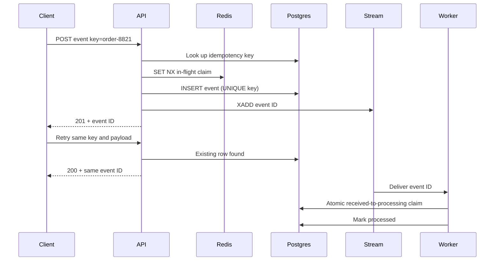

# EventLedger

[](https://github.com/ARasugit20/eventLedger/actions/workflows/ci.yml)

CI: passing (Postgres-backed integration tests via testcontainers)

**Idempotent event ingestion for retry-heavy order, claims, and webhook workflows.**

EventLedger prevents a retried request from creating a second durable event or running
the handler again. The API combines:

1. a PostgreSQL lookup for an already-committed idempotency key
   ([`app/services/events.py`](app/services/events.py));
2. Redis `SET NX` to coordinate requests that are concurrently in flight
   ([`app/services/idempotency.py`](app/services/idempotency.py));
3. `UNIQUE(idempotency_key)` in PostgreSQL as the durable race arbiter
   ([`alembic/versions/001_initial_events.py`](alembic/versions/001_initial_events.py)); and
4. an atomic worker claim (`received → processing`) so only one worker owns an event
   ([`app/services/events.py`](app/services/events.py), [`app/worker.py`](app/worker.py)).

**Repo:** [github.com/ARasugit20/eventLedger](https://github.com/ARasugit20/eventLedger) · **API docs:** http://localhost:8000/docs

## What happens when the same event arrives twice?


```mermaid
sequenceDiagram
    participant Client
    participant API
    participant Redis
    participant Postgres
    participant Stream
    participant Worker

    Client->>API: POST event key=order-8821
    API->>Postgres: Look up idempotency key
    API->>Redis: SET NX in-flight claim
    API->>Postgres: INSERT event (UNIQUE key)
    API->>Stream: XADD event ID
    API-->>Client: 201 + event ID
    Client->>API: Retry same key and payload
    API->>Postgres: Existing row found
    API-->>Client: 200 + same event ID
    Stream->>Worker: Deliver event ID
    Worker->>Postgres: Atomic received-to-processing claim
    Worker->>Postgres: Mark processed
```

- The first request commits one row, queues one event ID, and returns **201**.
- A sequential duplicate finds that row and returns **200** with the same UUID; it is
  not queued again.
- Concurrent duplicates are narrowed by Redis, but PostgreSQL uniqueness is the final
  authority if requests still race.
- Reusing the same key with a different event type or payload returns **409**.

The guarantee is **at-least-once stream delivery with guarded handler execution**, not
exactly-once delivery across arbitrary external systems.

## One-command proof

From the repository root:

```bash
./scripts/demo_idempotency.sh
```

The script ([`scripts/demo_idempotency.sh`](scripts/demo_idempotency.sh)) starts Docker
Compose, waits for health, sends the same event twice, proves `201 → 200` with one UUID,
waits for `processed`, prints duplicate analytics and Prometheus ingest counters, and
shows the correlated API/worker logs.

## Failure modes

| Failure | Current behavior | Boundary / missing protection | Evidence |
|---------|------------------|-------------------------------|----------|
| Redis is unavailable | A retry for an already-committed key can resolve from PostgreSQL. A new event currently fails during the Redis claim. | Ingest does **not** fail open to PostgreSQL today. | [`app/services/idempotency.py`](app/services/idempotency.py) |
| PostgreSQL commits but Redis `XADD` keeps failing | The API logs after three enqueue attempts; the event remains `received`. | There is no transactional outbox or automatic scanner to enqueue the stranded row. | [`app/services/events.py`](app/services/events.py) (`_enqueue_event`) |
| Worker dies before claiming | The message remains in the Redis pending-entry list and can be reclaimed with `XAUTOCLAIM`. | Recovery begins only after `PENDING_IDLE_MS`. | [`app/worker.py`](app/worker.py) (`reclaim_stale_messages`) |
| Worker dies after committing `processing` | A later delivery cannot acquire the `received → processing` claim. | There is no processing lease/watchdog; the row can remain stuck in `processing`. | [`app/services/events.py`](app/services/events.py) (`try_claim_for_processing`) |
| Two workers race for one event | PostgreSQL's conditional update allows one claim; the loser performs no handler work. | This protects the current handler path, but cannot make external side effects exactly-once by itself. | [`app/services/events.py`](app/services/events.py), [`tests/test_concurrency.py`](tests/test_concurrency.py) |

See [docs/OPERATIONS.md](docs/OPERATIONS.md) for retries, durable DLQ behavior, and
manual recovery notes.

## Evidence in the repository

| Capability | Evidence |
|------------|----------|
| 50-way concurrent ingest dedupe | [`tests/test_concurrency.py`](tests/test_concurrency.py) — one `201`, 49 `200`s, one UUID, one row |
| Sequential duplicate + single-processing guard | [`tests/test_idempotency.py`](tests/test_idempotency.py) |
| Durable DLQ after bounded retries | [`app/dlq.py`](app/dlq.py), [`alembic/versions/002_dead_letter_events.py`](alembic/versions/002_dead_letter_events.py), [`tests/test_dlq.py`](tests/test_dlq.py) |
| One-command duplicate demo | [`scripts/demo_idempotency.sh`](scripts/demo_idempotency.sh) |
| Measured load benchmark | [`loadtest/results.md`](loadtest/results.md) |
| SQL analytics views | [`analytics/views.sql`](analytics/views.sql), [`app/routers/analytics.py`](app/routers/analytics.py) |
| Scheduled DLQ health sweep | [`orchestration/dag.py`](orchestration/dag.py) |
| CI with 75% coverage gate | [`.github/workflows/ci.yml`](.github/workflows/ci.yml) |
| Model-Lineage-Guard consumer | [`.github/workflows/ci.yml`](.github/workflows/ci.yml) (`lineage-guard-smoke` job) |

## Observability: PARTIAL

The Compose stack includes Prometheus, Grafana provisioning, and the exported
[`EventLedger Overview`](deploy/grafana/dashboards/eventledger.json) dashboard.

| Service | URL |
|---------|-----|
| API + OpenAPI | http://localhost:8000/docs |
| API metrics | http://localhost:8000/metrics |
| Prometheus | http://localhost:9090 |
| Grafana | http://localhost:3000 (admin/admin) |

**What works:** API ingest counters (`events_ingested_total`) are live at
[`app/main.py`](app/main.py) and scraped by
[`deploy/prometheus.yml`](deploy/prometheus.yml) from `api:8000`.

**What is PARTIAL:** Worker latency, retry, stream-pending, failure, and DLQ metrics are
defined in [`app/metrics.py`](app/metrics.py) and incremented in
[`app/worker.py`](app/worker.py), but the worker process has no `/metrics` endpoint and
is not scraped. The corresponding Grafana panels and Prometheus alert rules will not
receive worker samples in the default stack.

## Analytics

| Endpoint | Question | Evidence |
|----------|----------|----------|
| `GET /analytics/health` | How healthy is the pipeline right now? | [`analytics/views.sql`](analytics/views.sql) |
| `GET /analytics/duplicate-rate` | Which event types see the most retries? | [`analytics/views.sql`](analytics/views.sql) |
| `GET /analytics/latency` | p50/p95/p99 processing time by type? | [`analytics/views.sql`](analytics/views.sql) |
| `GET /analytics/daily-volume` | Daily ingest volume and failure rate? | [`analytics/views.sql`](analytics/views.sql) |
| `GET /analytics/dlq` | Durable dead-letter count and oldest-item age? | [`app/dlq.py`](app/dlq.py) |

Duplicate HTTP attempts are append-only in `ingest_attempts`; `events` keeps one row
per idempotency key. The optional Airflow profile performs scheduled DLQ health sweeps
([`orchestration/dag.py`](orchestration/dag.py)); ingestion and worker processing
remain application-managed.

## What I'd build next

- Add a transactional outbox so a committed event cannot be lost between PostgreSQL
  and Redis Streams.
- Replace permanent `processing` claims with leases plus a recovery sweep.
- Add bounded queue depth, producer backpressure, and explicit rate limits.
- Export and scrape worker-process metrics instead of presenting unsampled panels.
- Require downstream idempotency keys or transactional sinks; document why
  "exactly-once" is a system-wide tradeoff, not a queue setting.

## Verify locally

```bash
pip install -r requirements.txt
make test-cov
ruff check app tests analytics scripts
docker compose config
```

---

## Stack

Python 3.11 · FastAPI · PostgreSQL 16 · Redis 7 · SQLAlchemy 2 + Alembic · pytest + testcontainers · Prometheus + Grafana · Docker Compose

---

## Project layout

```
app/           FastAPI routes, worker, metrics, services
analytics/     SQL views + apply script
tests/         Idempotency, concurrency, analytics, metrics
deploy/        Prometheus + Grafana provisioning
scripts/       demo_idempotency.sh, seed_analytics_demo.py
docs/          Interview notes, load test, contributions
orchestration/ Airflow DLQ health-sweep DAG
loadtest/      Measured wrk/hey benchmark script and results
```

---

## Deep dive docs

- [Operations guide](docs/OPERATIONS.md) — retry/DLQ, correlation IDs, alerts
- [Interview talking points](docs/INTERVIEW.md) — idempotency, at-least-once, failure modes
- [Load testing](docs/LOAD_TEST.md) — `./loadtest/run.sh` and measured [`loadtest/results.md`](loadtest/results.md)
- [Contributions & GitHub graph](docs/CONTRIBUTIONS.md) — email, timestamps, green squares

---

**Resume bullet:** Built EventLedger — idempotent event ingestion API (FastAPI, PostgreSQL, Redis) with background workers, Prometheus observability, SQL analytics, and CI-verified concurrency tests.
